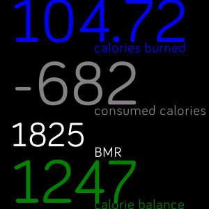

one click install from this url :https://gallery.fitbit.com/details/f6c80bec-8118-49b8-9de5-c56215726294

This app display calorie_burn, food_calories, and calorie_balance
-calorie_burn is reduced by 40% since fitbit calculations may be overly optimistic
-food_calories are subtracted by the users BMR

# How to install
1. resigter an app on dev.fitbit.com.apps
2. copy paste the clientID and client_secret into setting/index.jsx
3. go to fitbit.studio.com
4. connect Fitbitwatch to the debugger 
5. connect phone to the debugger
6. select the phone ans watch from the drop down menu and click run
7. after sucessful install open fitbit app on your phone
8. open devleopermenu on your phone and open companionApp under sideloaded apps
9. click settings and you will be prompted to login
10. on your watch slide right until you find the companionApp
11. click the app to run